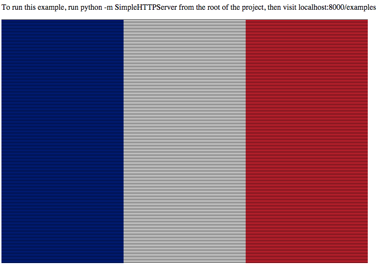

## raw-image

A helper for manipulating raw image data and rendering it to a canvas.

## Setup

Install the package.

```
npm install raw-image --save
```

Require the module.

```javascript
var RawImage = require("raw-image");
```

Note: RawImage needs to run a browser context. You can use something like
[browserify](http://browserify.org/) to bundle RawImage as a dependency. Take a
look at the example if you need help with this.


## Usage

```html
<canvas id="canvas"></canvas>

<script>
  var image = new RawImage("image.png");
  image.onload = function () {

    // Get the dimensions of the image.
    image.width;
    image.height;

    // Get the color of a pixel.
    image.get(50, 50);

    // Set the color of a pixel.
    var white = {
      "red":   255,
      "green": 255,
      "blue":  255,
      "alpha": 255
    };
    image.set(50, 50, white);

    // Render the image to a canvas.
    var canvas = document.getElementById("canvas");
    image.render(canvas);
  }
</script>
```

If you change the image, you'll need to re-render it.


## Dimensions

You can change the dimensions of the image by passing a width and/or a height:

```javascript
new RawImage("image.png", { width: 100, height: 100 });
```

The aspect ratio of the image is preserved and the image will not exceed
100x100.

The get and set methods will respect the new image dimensions.

## Serialization

Once the image has loaded, you can serialize your image to json:

```javascript
var image = new RawImage("image.png");
var json;

image.onload = function () {
  json = JSON.stringify(image);
};

var clone = RawImage.fromJson(json);
clone.get(50, 50);
```

## Screenshot



## Contribution

Please send a pull request or open an issue.

You should follow me on [twitter](https://twitter.com/cpatuzzo).
